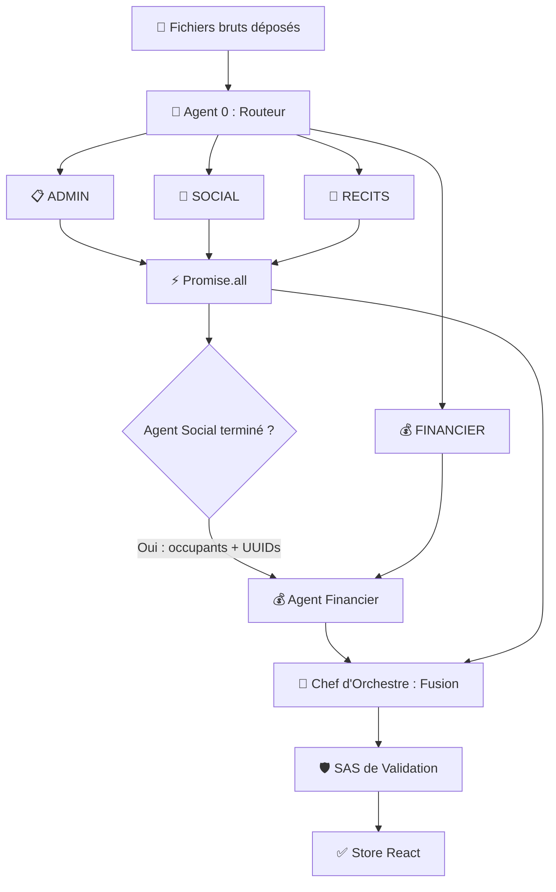
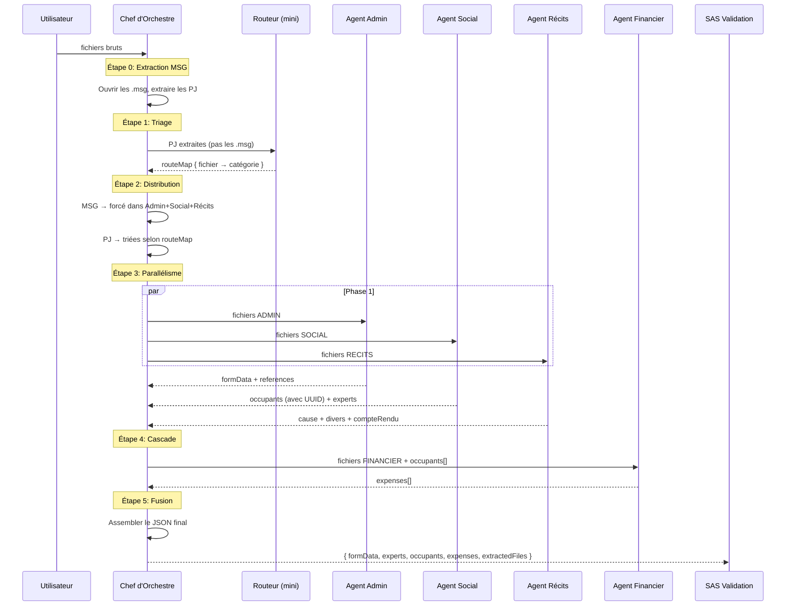
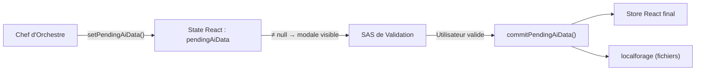
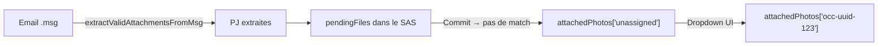
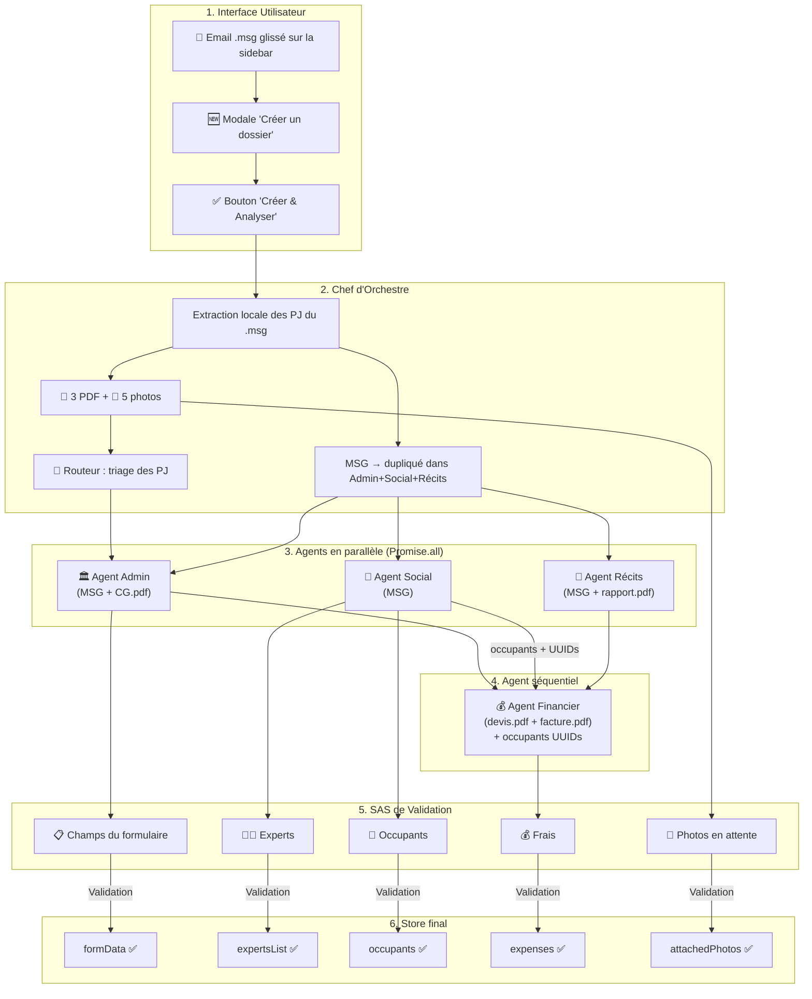

# 🧠 Guide Technique — Architecture Multi-Agents & SAS de Validation
## ExpertisesCodeJules v5.5.10 — Bureau Yves Péchard s.a.

---

## Table des matières

1. [Vision d'ensemble](#1-vision-densemble)
2. [Architecture du Pipeline en Cascade](#2-architecture-du-pipeline-en-cascade)
3. [Agent 0 — Le Routeur (Triage)](#3-agent-0--le-routeur-triage)
4. [Agent 1 — L'Agent Administratif (Le Bureaucrate)](#4-agent-1--lagent-administratif-le-bureaucrate)
5. [Agent 2 — L'Agent Social (Le Réseauteur)](#5-agent-2--lagent-social-le-réseauteur)
6. [Agent 3 — L'Agent Récits (Le Rédacteur)](#6-agent-3--lagent-récits-le-rédacteur)
7. [Agent 4 — L'Agent Financier (Le Comptable)](#7-agent-4--lagent-financier-le-comptable)
8. [Agent 5 — Le Chef d'Orchestre](#8-agent-5--le-chef-dorchestre)
9. [Le SAS de Validation (GlobalValidationModal)](#9-le-sas-de-validation-globalvalidationmodal)
10. [Les Dropzones Modulaires](#10-les-dropzones-modulaires)
11. [Mécanismes de sécurité](#11-mécanismes-de-sécurité)
12. [Photos en attente d'attribution](#12-photos-en-attente-dattribution)
13. [Diagramme de flux complet](#13-diagramme-de-flux-complet)

---

## 1. Vision d'ensemble

### Le problème d'origine
Quand un gestionnaire de sinistres reçoit un dossier, il reçoit en vrac : des emails Outlook (.msg) contenant des pièces jointes, des polices d'assurance (PDF), des devis/factures, des photos de dégâts, des rapports de recherche de fuite, etc. Avant ExpertisesCodeJules, un gestionnaire passait **des heures** à copier-coller manuellement chaque information du bon document dans la bonne case.

### La solution v5.4 (monolithique)
La première version de l'IA utilisait **un seul prompt géant** qui tentait de tout extraire d'un coup. Problème : quand on envoyait 50 fichiers, l'IA souffrait du syndrome "Lost in the Middle" — elle manquait des données, mélangeait les sources, et le taux d'erreur grimpait avec le volume.

### La solution v5.5 (multi-agents)
Nous avons implémenté une **Architecture Agentic Workflow** (Multi-Agents en Cascade) inspirée des pratiques industrielles de traitement documentaire. Au lieu d'un seul gros cerveau, nous utilisons **6 agents spécialisés**, chacun expert dans un domaine métier strict :

| # | Agent | Rôle | Modèle |
|---|---|---|---|
| 0 | **Le Routeur** | Triage des documents | GPT-4o-mini |
| 1 | **L'Administratif** | Contrats & coordonnées | GPT-4o |
| 2 | **Le Social** | Parties & occupants | GPT-4o |
| 3 | **Le Rédacteur** | Cause & récits | GPT-4o |
| 4 | **Le Financier** | Devis & factures | GPT-4o |
| 5 | **Le Chef d'Orchestre** | Coordination & assemblage | Code JS |

> [!IMPORTANT]
> **Principe fondamental** : Un agent = une tâche = un focus à 100%. L'Agent Financier ne regarde jamais les contrats. L'Agent Administratif ne s'occupe jamais des montants. Cette spécialisation élimine les hallucinations croisées.

---

## 2. Architecture du Pipeline en Cascade

Le pipeline n'est **pas** un simple parallélisme aveugle. Il suit un ordre logique dicté par les **dépendances de données** :



### Pourquoi cette séquence ?

L'Agent Financier a **besoin** de la liste des occupants (avec leurs UUIDs) générée par l'Agent Social. Sans cette information, il ne peut pas relier une facture au bon destinataire. C'est le cœur de la cascade :

1. **Phase 1 (Parallèle)** : Agents Administratif + Social + Récits tournent en même temps (`Promise.all`)
2. **Phase 2 (Séquentielle)** : On attend que l'Agent Social ait fini pour récupérer les occupants
3. **Phase 3 (Séquentielle)** : L'Agent Financier reçoit les fichiers financiers + la liste des occupants
4. **Phase 4 (Fusion)** : Le Chef d'Orchestre assemble le JSON final

---

## 3. Agent 0 — Le Routeur (Triage)

> **Fichier** : [aiManager.js](file:///c:/Users/MaquetAntoine/OneDrive%20-%20Bureau%20Yves%20Péchard%20s.a/Documents/expertisescodejules/src/services/aiManager.js#L555-L660)
> **Fonction** : `routeDocuments(files)`
> **Modèle** : `gpt-4o-mini` (rapide, peu coûteux)
> **Température** : 0.1

### Rôle
Le Routeur est le **premier agent** à intervenir. Il ne fait qu'une seule chose : lire un extrait de chaque document et le classer dans l'une des 4 catégories. C'est un filtre de triage ultra-rapide.

### Optimisation des coûts
- Pour les **PDF**, seule la **première page** est envoyée (pas les 20 pages)
- Pour les **emails .msg**, seuls les **1500 premiers caractères** du corps sont lus
- Le modèle **GPT-4o-mini** est utilisé au lieu de GPT-4o (10x moins cher)

### Catégories de tri

| Catégorie | Documents typiques |
|---|---|
| `ADMIN` | Polices d'assurance, conditions générales, convocations d'expertise |
| `SOCIAL` | Emails de syndic avec noms, cartes d'identité, listes de copropriétaires |
| `RECITS` | Rapports d'intervention, constats pompiers, chronologies |
| `FINANCIER` | Devis, factures, tickets de caisse |

### System Prompt (verbatim)

```
Tu es un routeur intelligent chargé de trier des documents d'assurance et d'expertise sinistre.
Tu dois classer CHAQUE document fourni dans l'une des 4 catégories suivantes, et STRICTEMENT celles-ci :
- "ADMIN" : Polices d'assurance, conditions générales, convocations d'expertise, documents officiels de couverture.
- "SOCIAL" : Emails de syndic listant des noms, cartes d'identité, documents d'assurance personnels ou échanges informels.
- "RECITS" : Rapports d'intervention, constats pompiers, chronologies des faits, déclarations circonstanciées.
- "FINANCIER" : Devis, factures, tickets de caisse, justificatifs de paiement.

Analyse l'extrait (texte ou 1ère page) de chaque document et détermine sa catégorie.

Tu dois renvoyer STRICTEMENT un objet JSON valide qui mappe le nom exact de chaque fichier à sa catégorie.
Format attendu :
{
  "nomDuFichier1.pdf": "ADMIN",
  "email_syndic.msg": "SOCIAL",
  "facture_plombier.jpg": "FINANCIER"
}
Ne renvoie aucun autre texte, juste le JSON.
```

### Sortie JSON

```json
{
  "police_axa.pdf": "ADMIN",
  "email_syndic_maigret.msg": "SOCIAL",
  "rapport_fuite.pdf": "RECITS",
  "devis_plombier_dubois.pdf": "FINANCIER",
  "IMG_1099.jpeg": "SOCIAL"
}
```

### Cas spécial : Fichiers .msg (emails Outlook)

Les emails sont un cas particulier car ils contiennent **de tout** : du texte avec des noms (social), des infos de contrat (admin), et des pièces jointes (financier). Le Chef d'Orchestre gère ce cas via une stratégie de **duplication** :

1. Le fichier `.msg` est ouvert localement (pas besoin d'API)
2. Les pièces jointes (PDF, images) sont extraites et envoyées au Routeur individuellement
3. Le corps de l'email est envoyé **simultanément** aux Agents Admin + Social + Récits

---

## 4. Agent 1 — L'Agent Administratif (Le Bureaucrate)

> **Fichier** : [aiManager.js](file:///c:/Users/MaquetAntoine/OneDrive%20-%20Bureau%20Yves%20Péchard%20s.a/Documents/expertisescodejules/src/services/aiManager.js#L676-L789)
> **Fonction** : `extractAdministrativeData(files)`
> **Modèle** : `gpt-4o`
> **Température** : 0.1 (précision maximale)

### Rôle
Cet agent lit les documents classés `ADMIN` (polices d'assurance, conditions particulières, correspondances officielles) et remplit les sections **Titre & Coordonnées** et **Informations Contractuelles** du formulaire.

### Champs extraits

#### Bloc "Coordonnées de l'expertise"
| Champ | Description | Exemple |
|---|---|---|
| `dateExp` | Date de l'expertise | `2026-06-15` |
| `heureExp` | Heure de l'expertise | `10:00` |
| `nomResidence` | Nom de la résidence | `Copropriété Les Acacias` |
| `adresse` | Adresse complète | `12 rue de la Paix, 1000 Bruxelles` |
| `refPechard` | Référence interne Bureau | `DOSS-2026-001` |
| `expertInfos` | Expert en charge | `M. Dupont` |
| `bureau` | Bureau d'expertise | `Bureau Péchard` |

#### Bloc "Informations contractuelles"
| Champ | Description | Exemple |
|---|---|---|
| `dateSinistre` | Date de survenance | `2026-06-01` |
| `dateDeclaration` | Date de déclaration | `2026-06-02` |
| `declarant` | Entité déclarante | `Syndic ABC` |
| `nomCie` | Compagnie d'assurance | `AXA Belgium` |
| `nomContrat` | Produit d'assurance | `Top Habitation` |
| `numPolice` | Numéro de police | `POL-123456` |
| `numSinistreCie` | N° sinistre chez la Cie | `SIN-2026-999` |
| `numConditionsGenerales` | Référence des CG | `CG-2023-V2` |
| `franchise` | Montant/règle de franchise | `250` |
| `pertesIndirectes` | % de pertes indirectes | `10%` |
| `isAxa` | Booléen détection AXA | `true` |

#### Bloc "Contradictoire" (si applicable)
| Champ | Description |
|---|---|
| `isContradictoire` | Toggle contradictoire |
| `cieContradictoire` | Compagnie adverse |
| `bureauContradictoire` | Bureau adverse |
| `expertContradictoire` | Expert adverse |
| `compteDeContradictoire` | Pour le compte de... |

#### Tableau "Références" (dynamique)
```json
"references": [{ "nom": "M. Martin", "ref": "Réf Client 789" }]
```

### System Prompt (verbatim)

```
Tu es un Agent Administratif expert en assurances et expertises sinistres. 
Ton rôle est d'analyser attentivement les documents fournis (polices d'assurance, conditions 
particulières, convocations, correspondances) et d'en extraire les informations contractuelles, 
les coordonnées de l'expertise et les références.

RÈGLES ABSOLUES :
1. N'invente AUCUNE information. Si l'information n'est pas explicitement présente dans le 
   document, renvoie une chaîne vide "".
2. Remplis les champs avec précision.
3. Si la compagnie d'assurance (nomCie) est "AXA", ou une de ses filiales, tu DOIS ABSOLUMENT 
   mettre le booléen "isAxa" à true. Sinon false.
4. "bureau" doit être "Bureau Péchard" par défaut si non spécifié, mais respecte la valeur 
   si elle existe.
5. "pertesIndirectes" doit être un pourcentage (ex: "10%") ou "" si non trouvé.
6. Tu dois renvoyer STRICTEMENT et UNIQUEMENT un objet JSON valide, sans aucune introduction, 
   sans formatage markdown additionnel autre que le JSON.

Voici le format EXACT attendu, avec tous les champs présents :
{
  "formData": {
    "dateExp": "", "heureExp": "", "nomResidence": "", "adresse": "", "refPechard": "", 
    "expertInfos": "", "bureau": "Bureau Péchard",
    "dateSinistre": "", "dateDeclaration": "", "declarant": "", "nomCie": "", "nomContrat": "", 
    "numPolice": "", "numSinistreCie": "", 
    "numConditionsGenerales": "", "franchise": "", "pertesIndirectes": "", "isAxa": false,
    "isContradictoire": false, "cieContradictoire": "", "bureauContradictoire": "", 
    "expertContradictoire": "", "compteDeContradictoire": ""
  },
  "references": [ 
    { "nom": "", "ref": "" } 
  ]
}
```

### Post-traitement (v5.5.10)
Après réception de la réponse, l'agent applique une **normalisation automatique des dates**. L'IA renvoie souvent des dates au format `DD/MM/YYYY` ou `MM/YYYY` (ex: `"06/2026"`), mais le champ HTML `<input type="date">` exige `YYYY-MM-DD`. La fonction `normalizeDate()` gère ces conversions :

- `"15/06/2026"` → `"2026-06-15"` ✅
- `"06/2026"` → `"2026-06-01"` ✅ (1er du mois par défaut)
- `"2026-06-15"` → `"2026-06-15"` ✅ (déjà bon)

---

## 5. Agent 2 — L'Agent Social (Le Réseauteur)

> **Fichier** : [aiManager.js](file:///c:/Users/MaquetAntoine/OneDrive%20-%20Bureau%20Yves%20Péchard%20s.a/Documents/expertisescodejules/src/services/aiManager.js#L791-L910)
> **Fonction** : `extractSocialData(files)`
> **Modèle** : `gpt-4o`
> **Température** : 0.1

### Rôle
C'est l'agent le plus **stratégique** du pipeline. Il identifie toutes les personnes impliquées dans le dossier (propriétaires, locataires, experts, syndics) et génère des **UUIDs uniques** pour chaque occupant. Ces UUIDs serviront de **clés primaires** pour l'Agent Financier.

### Champs extraits par occupant

| Champ | Type | Description |
|---|---|---|
| `nom` | string | Nom de famille |
| `prenom` | string | Prénom |
| `etage` | string | Étage/lot (ex: "RDC", "3ème") |
| `statut` | enum | **Strictement** : `Locataire`, `Propriétaire occupant`, `Propriétaire non occupant`, ou `Autre` |
| `tel` | string | Téléphone |
| `email` | string | Email |
| `rc` | boolean | A une assurance Responsabilité Civile ? |
| `rcPolice` | string | N° de police RC |
| `secAssurance` | boolean | A une couverture Secours/Incendie ? |
| `secCie` | string | Compagnie secours |
| `secPolice` | string | N° de police secours |
| `secType` | string | Type de couverture secours |
| `contreExpert` | boolean | Exclure des calculs financiers ? |

### System Prompt (verbatim)

```
Tu es un Agent Social expert dans l'analyse de documents liés aux expertises immobilières.
Ton rôle est de lire ces documents (emails de syndics, tableaux de contacts, baux de location) 
et d'en extraire TOUS les intervenants (experts et occupants).

RÈGLES ABSOLUES :
1. N'invente AUCUNE information. Si l'information n'est pas présente, renvoie une chaîne vide "" 
   ou false pour les booléens.
2. Le champ "statut" de chaque occupant DOIT IMPÉRATIVEMENT être l'une de ces valeurs exactes : 
   "Locataire", "Propriétaire occupant", "Propriétaire non occupant", ou "Autre". 
3. Tu dois renvoyer STRICTEMENT et UNIQUEMENT un objet JSON valide, sans aucune introduction, 
   sans formatage markdown additionnel autre que le JSON.

Voici le format EXACT attendu, avec tous les champs présents :
{
  "experts": [ { "nom": "", "tel": "" } ],
  "occupants": [
    {
      "nom": "", "prenom": "", "etage": "", "statut": "Locataire", "tel": "", "email": "",
      "rc": false, "rcPolice": "", "secAssurance": false, "secCie": "", "secPolice": "", 
      "secType": "", "contreExpert": false
    }
  ]
}
```

### Post-traitement critique
Après réception, le code ajoute un **UUID unique** à chaque occupant via `crypto.randomUUID()`. L'IA ne peut pas générer de vrais UUIDs côté navigateur, donc c'est le code JavaScript qui s'en charge :

```javascript
parsedData.occupants = parsedData.occupants.map(occ => ({
    ...occ,
    id: crypto.randomUUID()  // Ex: "a1b2c3d4-e5f6-..."
}));
```

> [!TIP]
> C'est ce mécanisme d'UUID qui permet à l'Agent Financier de **lier une facture au bon occupant** en Phase 2. Sans cet UUID, la liaison serait impossible.

---

## 6. Agent 3 — L'Agent Récits (Le Rédacteur)

> **Fichier** : [aiManager.js](file:///c:/Users/MaquetAntoine/OneDrive%20-%20Bureau%20Yves%20Péchard%20s.a/Documents/expertisescodejules/src/services/aiManager.js#L912-L1018)
> **Fonction** : `extractNarrativeData(files)`
> **Modèle** : `gpt-4o`
> **Température** : 0.2 (légèrement plus haut pour une rédaction fluide)

### Rôle
Cet agent lit les rapports techniques (recherches de fuite, constats pompiers, chronologies) et rédige des synthèses professionnelles pour les sections **Cause** et **Divers** du rapport d'expertise.

### Champs extraits

| Champ | Description | Usage |
|---|---|---|
| `cause` | Paragraphe d'explication technique de l'origine du sinistre | Section "Cause et description du sinistre" |
| `divers` | Remarques diverses et points d'attention | Section "Divers & Remarques" |
| `compteRendu` | Compte-rendu chronologique de la visite | Section "Compte rendu" |

### System Prompt (verbatim)

```
Tu es un Agent Rédacteur spécialisé dans les expertises sinistres.
Ton rôle est d'analyser des documents narratifs (rapports de recherche de fuite, constats 
pompiers, emails circonstanciés, chronologies) et de rédiger une synthèse professionnelle, 
claire et factuelle.

RÈGLES ABSOLUES :
1. Reste 100% neutre et objectif. Ne fais aucune supposition.
2. Si un champ ne peut pas être rempli grâce aux documents fournis, renvoie une chaîne vide "".
3. Ne casse pas la logique métier : la cause doit être technique et précise. Le compte rendu 
   doit refléter l'ordre des événements ou la chronologie de la visite.
4. Tu dois renvoyer STRICTEMENT et UNIQUEMENT un objet JSON valide, sans aucune introduction, 
   ni markdown autre que la structure demandée.

Voici le format EXACT attendu :
{
  "cause": "Paragraphe expliquant l'origine technique et la description des dommages 
            (ex: rupture de canalisation, engorgement).",
  "divers": "Remarques diverses, points d'attention particuliers, ou informations qui ne 
             rentrent pas ailleurs.",
  "compteRendu": "Compte-rendu chronologique factuel de la visite ou de la succession 
                  des événements."
}
```

### Intégration au JSON final
Les champs `cause`, `divers` et `compteRendu` sont injectés **à l'intérieur** de l'objet `formData` lors de la fusion par le Chef d'Orchestre :

```javascript
formData: {
    ...(adminRes.data?.formData || {}),   // champs admin
    cause: narrativeRes.data?.cause || "",      // ← injecté ici
    divers: narrativeRes.data?.divers || "",    // ← injecté ici
    compteRendu: narrativeRes.data?.compteRendu || ""  // ← injecté ici
}
```

Cela permet au SAS de les afficher comme n'importe quel autre champ du formulaire, avec une checkbox de validation.

---

## 7. Agent 4 — L'Agent Financier (Le Comptable)

> **Fichier** : [aiManager.js](file:///c:/Users/MaquetAntoine/OneDrive%20-%20Bureau%20Yves%20Péchard%20s.a/Documents/expertisescodejules/src/services/aiManager.js#L1020-L1159)
> **Fonction** : `extractFinancialData(files, occupantsList)`
> **Modèle** : `gpt-4o`
> **Température** : 0.1 (précision absolue pour les chiffres)

### Rôle
C'est l'agent le plus **complexe** et le plus **critique**. Il lit les devis et factures, extrait les montants, et les lie aux occupants identifiés par l'Agent Social. C'est le seul agent qui reçoit un **contexte supplémentaire** (la liste des occupants avec leurs UUIDs).

### Paramètre spécial : `occupantsList`

L'Agent Financier reçoit la liste des occupants sous cette forme injectée dans son prompt :

```
Nom/Prénom: GOOSSE Christine | ID: a1b2c3d4-e5f6-7890-abcd-ef1234567890
Nom/Prénom: BORRELANS  | ID: b2c3d4e5-f6a7-8901-bcde-f12345678901
```

L'IA doit ensuite remplir le champ `compteDe` avec l'UUID correspondant, ou `"unassigned"` si elle ne trouve pas de correspondance.

### Champs extraits par ligne de frais

| Champ | Type | Description |
|---|---|---|
| `prestataire` | string | Nom de l'artisan/fournisseur |
| `type` | enum | `"Devis"` ou `"Facture"` |
| `ref` | string | N° de référence du document |
| `desc` | string | Description des travaux |
| `compteDe` | UUID/string | UUID de l'occupant ou `"unassigned"` |
| `montantReclame` | string | Montant déclaré (toujours HTVA) |
| `montantValide` | string | Montant retenu |
| `typeMontant` | enum | **Toujours** `"HTVA"` |
| `categorieGarantie` | enum | `"Principale"` ou `"Complémentaire"` |
| `tauxTVA` | number | Taux de TVA applicable |
| `factureRecue` | boolean | Facture acquittée ? |
| `pourcentageVetuste` | number | Vétusté appliquée (%) |
| `motifRefus` | string | Justification si rejet |
| `avisCouverture` | enum | `"Oui"` ou `"Non"` |
| `noteCouverture` | string | Pourquoi non couvert |
| `sourceFileName` | string | Nom EXACT du fichier source |

#### Champs du switch Devis/Facture (mémoire cachée)
| Champ | Description |
|---|---|
| `montantDevis` / `refDevis` / `prestataireDevis` / `descDevis` | Données sauvegardées du devis |
| `montantFacture` / `refFacture` / `prestataireFacture` / `descFacture` | Données sauvegardées de la facture |

### System Prompt (verbatim)

```
Tu es un Agent Financier expert en comptabilité et expertise sinistres.
Ton rôle est d'analyser des documents financiers (devis, factures, tickets) et d'extraire 
les réclamations financières.

RÈGLES ABSOLUES :
1. RÈGLE DU HTVA STRICT : TOUS les montants extraits (montantReclame, montantDevis, 
   montantFacture, montantValide) DOIVENT IMPÉRATIVEMENT être Hors TVA (HTVA). Si le texte 
   fournit un montant TVAC, extrais le HTVA ou déduis-le mathématiquement avec le taux de TVA 
   indiqué. Formate les montants sous forme de texte avec un point (ex: "450.00").
2. "typeMontant" DOIT TOUJOURS être "HTVA".
3. RÈGLE DES DEVIS ET FACTURES : Si le document est un DEVIS, remplis "montantDevis", 
   "refDevis", "prestataireDevis" et "descDevis". Si c'est une FACTURE, remplis 
   "montantFacture", "refFacture", "prestataireFacture" et "descFacture". Copie la valeur 
   la plus pertinente dans "montantReclame" et "montantValide". "type" doit valoir 
   "Devis" ou "Facture".
4. SOURCE FILE NAME : Remplis "sourceFileName" avec le nom EXACT du fichier parmi cette 
   liste : [facture_dubois.pdf, devis_peinture.pdf]. Il est interdit d'inventer un nom.
5. COMPTE DE (DESTINATAIRE) : Essaie de trouver à qui est adressée la facture parmi cette 
   liste de personnes : 
   Nom/Prénom: GOOSSE Christine | ID: a1b2c3d4-...
   Si tu trouves une correspondance claire, mets l'ID exact de cette personne dans "compteDe". 
   Sinon, écris STRICTEMENT "unassigned".
6. Tu dois renvoyer STRICTEMENT un JSON valide, sans introduction, ni markdown.

Format EXACT attendu :
{
  "expenses": [
    {
      "prestataire": "", "type": "Devis ou Facture", "ref": "", "desc": "", 
      "compteDe": "UUID_DE_L_OCCUPANT_MATCHÉ (ou unassigned)", 
      "montantReclame": "", "montantValide": "", 
      "typeMontant": "HTVA", "categorieGarantie": "Principale ou Complémentaire", 
      "tauxTVA": 0, "factureRecue": false, "pourcentageVetuste": 0, 
      "motifRefus": "", "avisCouverture": "Oui", "noteCouverture": "",
      "montantDevis": "", "refDevis": "", "prestataireDevis": "", "descDevis": "",
      "montantFacture": "", "refFacture": "", "prestataireFacture": "", "descFacture": "",
      "sourceFileName": "NOM_EXACT_DU_FICHIER"
    }
  ]
}
```

### Post-traitement
Après réception, le code ajoute un UUID à chaque ligne de frais et sécurise le champ `compteDe` :

```javascript
parsedData.expenses = parsedData.expenses.map(exp => ({
    ...exp,
    id: crypto.randomUUID(),
    compteDe: exp.compteDe || "unassigned"
}));
```

---

## 8. Agent 5 — Le Chef d'Orchestre

> **Fichier** : [aiManager.js](file:///c:/Users/MaquetAntoine/OneDrive%20-%20Bureau%20Yves%20Péchard%20s.a/Documents/expertisescodejules/src/services/aiManager.js#L1161-L1276)
> **Fonction** : `processGlobalIngestion(files)`
> **Type** : Code JavaScript pur (pas d'appel IA)

### Rôle
Le Chef d'Orchestre est le **coordinateur central**. Il ne fait pas d'analyse IA lui-même — il distribue le travail aux agents spécialisés et assemble leurs résultats. C'est une **fonction JavaScript asynchrone** qui gère le timing, les dépendances et la fusion.

### Pipeline détaillé



### Gestion spéciale des emails (.msg)

C'est le point le plus subtil de l'architecture. Un email contient potentiellement des informations pour **tous** les agents (noms d'occupants dans le corps, n° de police mentionné, récit du sinistre). Au lieu de le classer dans une seule catégorie, le Chef d'Orchestre applique une stratégie de **duplication** :

```javascript
// Les fichiers MSG contiennent souvent de TOUT. On les force dans les 3 agents principaux.
for (const msgFile of msgFiles) {
    adminFiles.push(msgFile);
    socialFiles.push(msgFile);
    narrativeFiles.push(msgFile);
}
```

Les pièces jointes extraites du MSG sont quant à elles envoyées au Routeur pour un triage individuel.

### JSON final assemblé

```javascript
const finalJson = {
    formData: {
        ...(adminRes.data?.formData || {}),     // Agent Admin
        cause: narrativeRes.data?.cause || "",   // Agent Récits
        divers: narrativeRes.data?.divers || "", // Agent Récits  
        compteRendu: narrativeRes.data?.compteRendu || "" // Agent Récits
    },
    references: adminRes.data?.references || [], // Agent Admin
    experts: socialRes.data?.experts || [],       // Agent Social
    occupants: occupants,                         // Agent Social (avec UUIDs)
    expenses: financialRes.data?.expenses || []   // Agent Financier
};

return { 
    success: true, 
    data: finalJson, 
    extractedFiles: allExtractedFiles  // PJ extraites des .msg
};
```

---

## 9. Le SAS de Validation (GlobalValidationModal)

> **Fichier** : [GlobalValidationModal.jsx](file:///c:/Users/MaquetAntoine/OneDrive%20-%20Bureau%20Yves%20Péchard%20s.a/Documents/expertisescodejules/src/components/GlobalValidationModal.jsx)

### Principe fondamental

> [!CAUTION]
> **On ne fait JAMAIS confiance à 100% à une IA dans le domaine financier.**

Le SAS est une **modale de validation** qui s'interpose entre la sortie IA et le store de données. Rien n'entre dans la base de données sans que l'utilisateur l'ait vu et validé.

### Flux de données



### Les 5 sections du SAS

#### Section 1 — Champs du formulaire (formData)
- Affiche chaque champ non-vide avec une **checkbox**
- Compare la valeur IA avec la valeur actuelle
- L'utilisateur coche/décoche les champs à importer
- Les champs sont éditables en temps réel avant validation

#### Section 2 — Experts (v5.5.10) 🆕
- Affiche les experts trouvés par l'Agent Social
- Les experts déjà connus dans la base sont **grisés** ("Déjà connu")
- Les nouveaux sont pré-cochés avec le badge "✨ Nouveau"
- La validation ajoute les experts cochés à `expertsList` (persistée en localStorage)

#### Section 3 — Occupants (accordéon)
- Chaque occupant IA est comparé aux occupants existants (fuzzy matching par nom)
- 3 actions possibles par occupant :
  - **Ajouter** : Crée un nouvel occupant
  - **Mettre à jour** : Fusionne les nouvelles données avec un occupant existant
  - **Ignorer** : Ne rien faire
- Tous les champs sont éditables dans l'accordéon (nom, prénom, statut, tel, email, RC, etc.)

#### Section 4 — Frais et réclamations (accordéon)
- Chaque ligne de frais est affichée avec le prestataire, le montant, le type
- Actions : Ajouter / Ignorer
- Les doublons stricts (même prestataire + même montant + même référence) sont automatiquement éliminés par `deduplicateExpenses()`
- Le badge "📎" indique qu'un fichier sera auto-attaché via le fuzzy matching

#### Footer
- Compteur en temps réel : "2 experts · 3 occupants · 5 frais · 6 📸 à importer"

### Mécanisme anti-race-condition

> [!IMPORTANT]
> C'est le point technique le plus délicat du SAS.

React met à jour les states de manière **asynchrone**. Si on appelle `setPendingAiData(merged)` puis immédiatement `commitPendingAiData(selections)`, le commit pourrait lire l'**ancienne** version de `pendingAiData`. 

Solution : `commitPendingAiData` accepte un paramètre `dataOverride` qui bypasse le state React :

```javascript
const handleValidate = () => {
    const mergedData = {
        ...pendingAiData,      // pendingFiles, experts
        ...editableData,       // formData, occupants, expenses (modifiés par l'user)
        pendingFiles: pendingAiData.pendingFiles || []  // safety net
    };
    setPendingAiData(mergedData);
    
    // ✅ Bypass React async : on passe les données directement
    commitPendingAiData(selections, mergedData);
};
```

### `commitPendingAiData()` — Le commit atomique

> **Fichier** : [ExpertiseContext.jsx](file:///c:/Users/MaquetAntoine/OneDrive%20-%20Bureau%20Yves%20Péchard%20s.a/Documents/expertisescodejules/src/context/ExpertiseContext.jsx#L1241-L1372)

Cette fonction effectue un **commit en 6 étapes** dans l'ordre :

| Étape | Action | Détails |
|---|---|---|
| 1 | **FormData** | Écrase les champs cochés (`setFormData`) |
| 2 | **Occupants** | Ajoute les nouveaux / met à jour les existants (`addOccupant`, `updateOccupant`) |
| 3 | **Expenses** | Ajoute les frais + auto-attach des fichiers via fuzzy matching (`addExpense`, `handleAttachFile`) |
| 4 | **Experts** | Ajoute les nouveaux experts à la base de données (`setExpertsList`) |
| 5 | **Photos** | Stocke les photos non-matchées en "attente d'attribution" (`handleAttachPhoto('unassigned', ...)`) |
| 6 | **Cleanup** | `setPendingAiData(null)` → ferme le SAS |

---

## 10. Les Dropzones Modulaires

L'un des avantages majeurs de l'architecture multi-agents est que **chaque agent est appelable individuellement**. Les dropzones de l'interface utilisent le bon agent selon leur contexte, sans passer par le Chef d'Orchestre.

### Tableau récapitulatif des points d'entrée

| Zone de l'UI | Agent appelé | Fonction | Fichier |
|---|---|---|---|
| **SAS Global** (GlobalAiAssistant) | Chef d'Orchestre | `processGlobalIngestion()` | [GlobalAiAssistant.jsx](file:///c:/Users/MaquetAntoine/OneDrive%20-%20Bureau%20Yves%20Péchard%20s.a/Documents/expertisescodejules/src/components/GlobalAiAssistant.jsx) |
| **Magic Drop MSG** (Sidebar, création dossier) | Chef d'Orchestre | `processGlobalIngestion()` | [Sidebar.jsx](file:///c:/Users/MaquetAntoine/OneDrive%20-%20Bureau%20Yves%20Péchard%20s.a/Documents/expertisescodejules/src/components/Sidebar.jsx#L1467) |
| **Dropzone Contrat** (section Info) | Agent Administratif | `extractAdministrativeData()` | [Sidebar.jsx](file:///c:/Users/MaquetAntoine/OneDrive%20-%20Bureau%20Yves%20Péchard%20s.a/Documents/expertisescodejules/src/components/Sidebar.jsx#L300) |
| **Dropzone Cause** (section Cause) | Agent Récits | `extractNarrativeData()` | [Sidebar.jsx](file:///c:/Users/MaquetAntoine/OneDrive%20-%20Bureau%20Yves%20Péchard%20s.a/Documents/expertisescodejules/src/components/Sidebar.jsx#L253) |
| **Dropzone Réclamations** (tableau des frais) | Agent Financier | `extractFinancialData()` | [Sidebar.jsx](file:///c:/Users/MaquetAntoine/OneDrive%20-%20Bureau%20Yves%20Péchard%20s.a/Documents/expertisescodejules/src/components/Sidebar.jsx#L344) |

### Exemple concret : Drop d'une facture sur le tableau des frais

Quand l'utilisateur glisse un PDF de facture **directement sur le tableau des réclamations** :

1. `handleMagicDrop()` est déclenché
2. Le Routeur et le Chef d'Orchestre sont **bypassés**
3. `extractFinancialData([file], occupants, apiKey)` est appelé directement
4. L'Agent Financier analyse le PDF et retourne une ligne `expenses[0]`
5. La modale d'ingestion (`UniversalIngestionModal`) s'ouvre avec les données pré-remplies
6. L'utilisateur valide → la ligne est ajoutée au tableau

> [!TIP]
> Ce bypass permet de traiter un seul document en **quelques secondes** au lieu de lancer tout le pipeline multi-agents.

---

## 11. Mécanismes de sécurité

### Anti-hallucination : Balises de contexte

Chaque document envoyé à un agent est encadré par des balises strictes :

```
[DÉBUT DOCUMENT : facture_dubois.pdf]
... contenu ...
[FIN DOCUMENT : facture_dubois.pdf]
```

Cela empêche l'IA de confondre les sources quand elle traite plusieurs fichiers. Le champ `sourceFileName` dans les expenses permet de vérifier que l'IA a correctement identifié l'origine du montant.

### Anti-doublons

Le SAS applique une **déduplication stricte** avant d'afficher les données :

```javascript
// Occupants : dédupliqués par nom (insensible à la casse)
const deduplicateOccupants = (occupants) => {
    const seen = new Map();
    return occupants.filter(occ => {
        const key = (occ.nom || '').toLowerCase().trim();
        if (!key || seen.has(key)) return false;
        seen.set(key, true);
        return true;
    });
};

// Expenses : dédupliqués par prestataire + montant + référence
const deduplicateExpenses = (expenses) => {
    const seen = new Map();
    return expenses.filter(exp => {
        const key = `${(exp.prestataire||'').toLowerCase().trim()}|${exp.montant}|${exp.ref}`;
        if (seen.has(key)) return false;
        seen.set(key, true);
        return true;
    });
};
```

### Fuzzy matching (auto-attachement)

Quand l'IA indique `sourceFileName: "facture_dubois.pdf"`, le système cherche le fichier correspondant dans `pendingFiles` avec une tolérance :
- Insensibilité à la casse
- Tolérance à l'absence d'extension
- Matching partiel du nom

### Mode Mock (développement)

Chaque agent possède un mode `mock` qui retourne des données factices sans appeler l'API. Activé automatiquement quand aucune clé API n'est configurée. Permet de tester l'UI et les flux de données sans consommer de tokens.

### `response_format: { type: "json_object" }`

Tous les agents utilisent le mode JSON natif d'OpenAI (`response_format`), ce qui **garantit** que la réponse est un JSON valide parseable. Plus besoin de `try/catch` pour gérer des réponses mal formées contenant du markdown.

---

## 12. Photos en attente d'attribution

### Le problème
Quand un email contient des photos de dégâts (ex: `IMG_1099.jpeg`, `IMG_1103.jpeg`), ces photos doivent être rattachées aux **occupants** (pas aux frais). Mais au moment de l'import, l'utilisateur n'a peut-être pas encore décidé quel occupant est concerné.

### La solution (v5.5.10)

1. **Pendant le commit** : Après avoir traité les frais, `commitPendingAiData` identifie les images non-matchées et les stocke via `handleAttachPhoto('unassigned', photo)`

2. **Dans l'UI** : La section PHOTOS affiche un bloc ambré **"📸 Photos en attente d'attribution"** avec :
   - Les vignettes des photos
   - Un bouton ✕ pour supprimer
   - Un **dropdown** "→ Attribuer à..." avec la liste des occupants

3. **Réattribution** : Quand l'utilisateur sélectionne un occupant dans le dropdown, la photo est copiée vers cet occupant et retirée de la zone "unassigned"



---

## 13. Diagramme de flux complet

### Scénario : L'utilisateur glisse un email .msg sur "Créer & Analyser"



---

## Annexe : Fichiers clés du projet

| Fichier | Rôle | Lignes |
|---|---|---|
| [aiManager.js](file:///c:/Users/MaquetAntoine/OneDrive%20-%20Bureau%20Yves%20Péchard%20s.a/Documents/expertisescodejules/src/services/aiManager.js) | Tous les agents IA + Chef d'Orchestre | ~1276 |
| [ExpertiseContext.jsx](file:///c:/Users/MaquetAntoine/OneDrive%20-%20Bureau%20Yves%20Péchard%20s.a/Documents/expertisescodejules/src/context/ExpertiseContext.jsx) | State global + `commitPendingAiData` + `processJsonData` | ~1500 |
| [GlobalValidationModal.jsx](file:///c:/Users/MaquetAntoine/OneDrive%20-%20Bureau%20Yves%20Péchard%20s.a/Documents/expertisescodejules/src/components/GlobalValidationModal.jsx) | SAS de validation (modale) | ~466 |
| [GlobalAiAssistant.jsx](file:///c:/Users/MaquetAntoine/OneDrive%20-%20Bureau%20Yves%20Péchard%20s.a/Documents/expertisescodejules/src/components/GlobalAiAssistant.jsx) | Interface du SAS global (drag & drop) | ~266 |
| [Sidebar.jsx](file:///c:/Users/MaquetAntoine/OneDrive%20-%20Bureau%20Yves%20Péchard%20s.a/Documents/expertisescodejules/src/components/Sidebar.jsx) | Toutes les dropzones + Magic Drop MSG | ~1590 |
| [financeStore.js](file:///c:/Users/MaquetAntoine/OneDrive%20-%20Bureau%20Yves%20Péchard%20s.a/Documents/expertisescodejules/src/store/financeStore.js) | Store Zustand (occupants, expenses, calculs) | - |

---

*Document généré le 11/06/2026 — ExpertisesCodeJules v5.5.10 — Bureau Yves Péchard s.a.*
